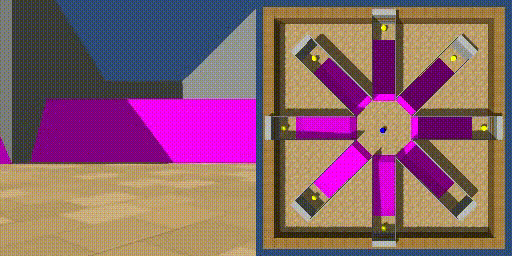
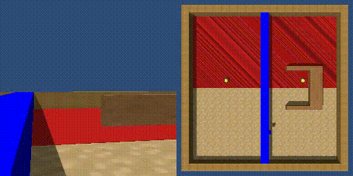
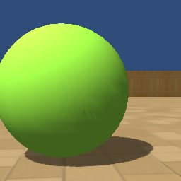

# ManimalAI

ManimalAI is an [AnimalAI](http://animalaiolympics.com/AAI/) clone eazy to install environment. To embody rigid body simulation and rendering, [rodentia](https://github.com/miyosuda/rodentia) library is used instead of Unity. **(Now work in progress)**







# Supported platforms

- Linux (Tested on Ubuntu 18.04)
- MacOSX (Tested on MacOSX 10.15.7, Catalina)


# Install


## Ubuntu

First confirm whether `cmake` is installed.

    $ cmake --version

If `cmake` is not installed, install it.

    $ sudo apt-get install cmake


And install with `manimalai` with pip

    $ sudo apt-get install -y python3-dev
    $ pip3 install manimalai


​    
## MacOSX

First confirm whether `cmake` is installed.

    $ cmake --version

If `cmake` is not installed, install it.

    $ brew install cmake

And install with `manimalai` with pip

    $ pip3 install manimalai

## Example

```python
import gym
import manimalai
from PIL import Image

class RandomAgent(object):
    def __init__(self, action_space):
        self.action_space = action_space

    def choose_action(self, state):
        return self.action_space.sample()

task_id = "1-1-1"
env = gym.make('ManimalAI-v0', width=256, height=256, task_id=task_id)
agent = RandomAgent(env.action_space)

state = env.reset()
    
for i in range(10):
    action = agent.choose_action(state)
    state, reward, terminal, _ = env.step(action=action)
    pimage = Image.fromarray(state)
    pimage.save("frame{}.png".format(i))
```




# TODO

- [ ] Transparent objects
- [ ] Mass / friction adjustment
- [ ] Hotzone damage adjustment
- [ ] Shadowmap bug fixing
- [ ] Add Dockerfile
