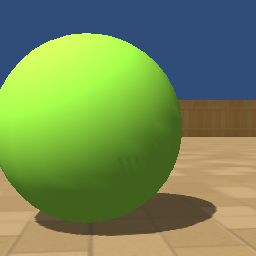

# ManimalAI Examples

## hello_manimal.py

Minimal example with a random action agent.




## capture.py
Captures all of the arena configuration setting with the bird's eye view.


## manual_control.py

Manual agent control example.

This example uses `pygame` library and threre is a compatibility problem with latest `pygame` and `rodentia` libraries on Linux. So please use `pygame 1.9.6` on Linux.

### MacOSX

```
$ pip3 install pygame==2.0.1
$ python3 manual_control.py
```

### Ubuntu

```
$ pip3 install pygame==1.9.6
$ python3 manual_control.py
```


